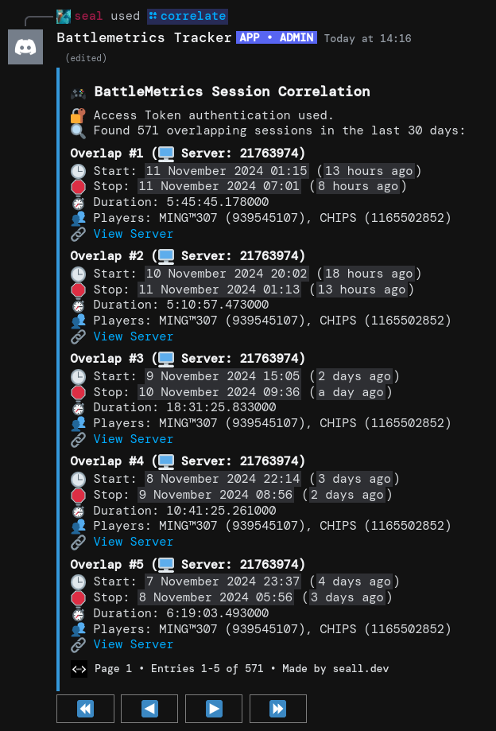
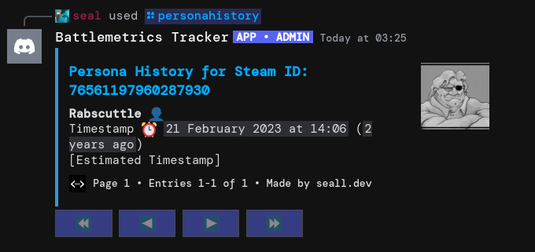

<div align="center">

# Rust Stalker


A Discord bot for monitoring and analyzing player activity on Rust servers using the Battlemetrics API. Get real-time notifications, track player movements, search for players, and correlate player sessions.

</div>

## Features

### Player Monitoring
- Real-time tracking of player online/offline status
- Server change detection and notifications
- Support for monitoring multiple players
- Automatic status updates through Discord

### Player Search
- A working search for Battlemetrics that only prints exact matches for the names you supply
- Filtering by game supported aswell
- Sorted by most recently online automatically
- Supports names with spaces


### Player Session Correlation
- Using Battlemetrics ID's will find all sessions displayed that share the same server and timeframe with another user
- Supports any amount of ID's to correlate
- Sorted by most recent



### Steam Alias History
- Utilising steamhistory.net
- Displays details about the users past aliases and timestamps of change



### Steam Username Dorks
- Supplies custom Google Dorks and URLs to search for a user from their username
- Various sites for TF2, CS2, Deadlock, Rocket League and general Steam related pages


### Streamer Mode Steam ID Lookups
- Supplies the Streamer Mode name of a user from a Steam ID
- Can be used to confirm if target users Streamer Mode name matches the profile


## Setup

Create a `.env` file with your Discord webhook URL:
```
DISCORD_BOT_TOKEN=<DISCORD-TOKEN>
MONITOR_CHANNEL_ID=<CH-ID>
MONITORED_IDS_JSON_FILE=tracked_users.json
```

### Windows
```bash
python -m pip install -r requirements.txt
python main.py
```

### Linux
```bash
./run.sh
```

## Discord Notification Examples

### Player Goes Online
todo

### Player Changes Server
todo

### Player Goes Offline
todo

## Core Functions

### General Functions
- `get_steam_avatar()`: Fetches a URL for the Steam Avatar given a Steam ID

### Battlemetrics Functions
- `get_battlemetrics_player()`: Fetch player status and data
- `get_online_server()`: Check current server
- `get_battlemetrics_server_details()`: Get server info
- `get_recently_visited_servers()`: View server history

### Monitoring
- `send_activity_embed()`: Send a new embed to the monitoring channel to announce a change to a players status
- `send_serverchange_embed()`: Send an embed for when the player changes server, but stays online

### Correlation
- `find_overlapping_sessions()`: From the given IDs find sessions in common

### Searching
- `search_player()`: Lists all players with that username from Battlemetrics

### Steam Dorking
- `build_steamfind_embed()`: Creates the embed of dorks for a given username

### Streamer Mode Lookup
- `get_streamermode_name()`: Finds the users streamermode name

## Credits
- Original author: sealldev / sealldeveloper
- Code adapted from: [alexemanuelol's 'team-detector'](https://github.com/alexemanuelol/team-detector)
- Streamer Mode Lookup from: [NotpainRaov's 'RustStreamerName'](https://github.com/NotpainRaov/RustStreamerName)

## License
GNU GPL v3.0
